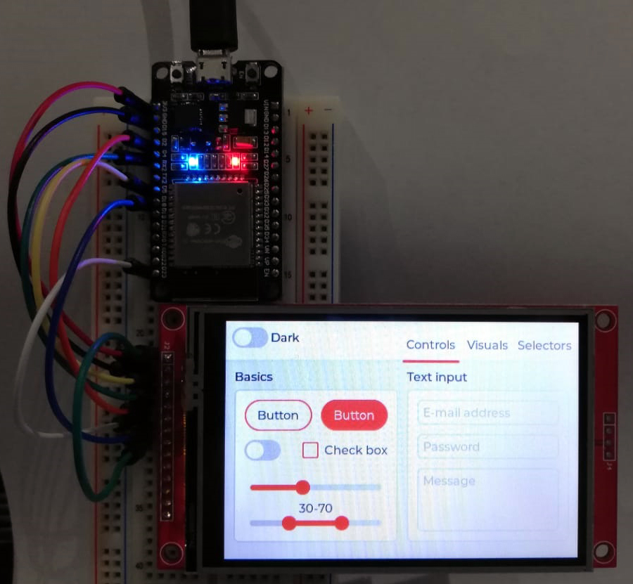

# LVGL project for ESP32

This is an ESP32 demo project showcasing LVGL v7 with support for several display controllers and touch controllers.
The demo application is the `lv_demo_widgets` project from the [lv_examples](https://github.com/lvgl/lv_examples) repository.

- Version of ESP-IDF required 4.2. NOTE: We're trying to make this repo backwards compatible, usage of idf.py is encouraged.
- Version of LVGL used: 7.9.
- Version of lv_examples used: 7.9.

#### Table of content
- [Get started](#get-started)
- [Use LVGL in your ESP-IDF project](#use-lvgl-in-your-esp-idf-project)
- [Use lvgl_esp32_drivers in your project](#use-lvgl_esp32_drivers-in-your-project)
- [Platformio support](#platformio-support)
- [ESP32-S2 Support](#esp32-s2-support)

Example demo for TFT displays:



Monochrome support:


## Display and touch controllers

The display and touch (indev) controllers are now into it's own repository, you can find it [here](https://github.com/lvgl/lvgl_esp32_drivers).
To report any issue or add new display or touch (indev) drivers you can do so in the `lvgl_esp32_drivers` repo.

## Get started

### Prerequisites

- ESP-IDF Framework.

### Note

This project tries to be compatible with both the ESP-IDF v3.x and v4.0, but using v4.0 is recommended.
Instructions assume you are using the v4.x toolchain, otherwise use the make commands, e.g. instead of running `idf.py menuconfig`, run `make menuconfig`.

### Build and run the demo.

1. Clone this project by `git clone --recurse-submodules https://github.com/lvgl/lv_port_esp32.git`, this will pull this repo and its submodules.

2. Get into the created `lv_port_esp32` directory.

3. Run `idf.py menuconfig`

4. Configure LVGL in `Components config->LVGL Configuration`. For monochrome displays use the mono theme and we suggest enabling the `unscii 8` font.

5. Configure your display and/or touch controllers in `Components config->LVGL TFT Display Configuration` and `Components config->LVGL TOUCH Configuration`.

6. Store your project configuration.

7. Build the project with `idf.py build`

8. If the build don't throw any errors, flash the demo with `idf.py -p (YOUR SERIAL PORT) flash` (with `make` this is just `make flash` - in 3.x PORT is configured in `menuconfig`)

## Use LVGL in your ESP-IDF project

LVGL now includes a Kconfig file which is used to configure most of the LVGL configuration options via menuconfig, so it's not necessary to use a custom `lv_conf.h` file.

It is recommended to add LVGL as a submodule in your IDF project's git repo.

From your project's root directory:
1. Create a directory named `components` (if you don't have one already) with `mkdir -p components`.
2. Clone the lvgl repository inside the `components` directory with `git submodule add https://github.com/lvgl/lvgl.git components/lvgl`
3. Run `idf.py menuconfig`, go to `Component config` then `LVGL configuration` to configure LVGL.

## Use lvgl_esp32_drivers in your project

It is recommended to add [lvgl_esp32_drivers](https://github.com/lvgl/lvgl_esp32_drivers) as a submodule in your IDF project's git repo.

From your project's root directory:
1. Create a directory named `components` (if you don't have one already) with `mkdir -p components`.
2. Clone the lvgl_esp32_drivers repository inside the `components` directory with `git submodule add https://github.com/lvgl/lvgl_esp32_drivers.git components/lvgl_esp32_drivers`
3. Run `idf.py menuconfig`, go to `Component config` then `LVGL TFT configuration` and `LVGL TFT Display configuration` to configure lvgl_esp32_drivers.

## Platformio support

Using the [lv_platformio](https://github.com/lvgl/lv_platformio) project add the following lines to `platformio.ini` file:

```
[env:esp32]
platform = espressif32
framework = espidf
board = esp-wrover-kit
```

Change the default environment to `default_envs = esp32`.

Modify the `main.c` like this:

```c
#include "lvgl.h"

// #include "driver.h"

#include "demo.h"

int app_main(void)
{
    lv_init();

    /* Initialize your hardware. */
    
    /* hw_init(); */

    demo_create();

    /* Create the UI or start a task for it.
     * In the end, don't forget to call `lv_task_handler` in a loop. */

    /* hw_loop(); */

    return 0;
}
```

For more information see: [platformio with espidf framework compability](https://github.com/lvgl/lv_port_esp32/issues/168).

# ESP32-S2 Support

Support for ESP32-S2 variant is Work In Progress.
Smaller displays (e.g. 320x240) work fine, but larger ones need testing.

## Background

ESP32-S2 has less on-chip SRAM than its predecessor ESP32 (520kB vs. 320kB).
This causes problems with memory allocation with large LVGL display buffers as they don't fit into the on-chip memory
and external PSRAM is not accessible by DMA.

Moreover, static allocation to external PSRAM is not yet supported
(see [GitHub issue](https://github.com/espressif/esp-idf/issues/6162)).

At this momement, the buffers are dynamicaly allocated with DMA capabilty and memory allocator handles the rest.
