# LVGL project for ESP32

LVGL ported to the ESP32.

Supported display controllers:

- IL3820
- ILI9341
- ILI9488
- ILI9486
- HX8357B/HX8357D
- ST7789
- SH1107
- SSD1306

Supported touchscreen controllers:

- XPT2046
- FT3236
- other FT6X36 or the FT6206 controllers should work as well (not tested)
- STMPE610

## Get started
### Install the ESP32 SDK
http://esp-idf.readthedocs.io/en/latest/

Note:

This project is compatible with both the ESP-IDF 3.X branch and the 4.0 branch. For the 4.0 branch, you can use either make or CMake, but CMake is recommended. Instructions here are given for the latest toolchain using `idf.py` (which invokes CMake), but it is easy to translate to make. For example instead of running `idf.py menuconfig`, just run `make menuconfig`.

### Build this repository standalone and run the demo.

Try this first to make sure your hardware is supported, wired and configured properly.

1. Get this project: `git clone --recurse-submodules
https://github.com/lvgl/lv_port_esp32.git`

2. From its root run `idf.py menuconfig`

3. Select your display kit or board and other options - see [config options](#configuration-options)

4. `idf.py build`

5. `idf.py -p (YOUR PORT) flash` (with make this is just `make flash` - in 3.x PORT is configured in `menuconfig`)

### Install this project as a library submodule in your own project

It is recommended to install this repo as a submodule in your IDF project's git repo. The configuration system has been designed so that you do not need to copy or edit any files in this repo. By keeping your submodule directory clean you can ensure reproducible builds and easy updates from this upstream repository.

From your project root (you can get the esp32 idf project template [here](https://github.com/espressif/esp-idf-template)):

1. `mkdir -p components`
2. `git submodule add https://github.com/lvgl/lv_port_esp32.git components/lv_port_esp32`
3. `git submodule update --init --recursive`
4. Edit your CMake or Makefile to add this repo's components folder to the IDF components path.


#### CMake

The examples below are taken from the ESP-IDF [blink](https://github.com/espressif/esp-idf/tree/master/examples/get-started/blink) example which you can copy and use as the basis for your own project.
The project root CMakeLists.txt file needs one line added, just before the project to add the extra components directory to the path like this:

```cmake
#CMakeLists.txt
cmake_minimum_required(VERSION 3.5)

include($ENV{IDF_PATH}/tools/cmake/project.cmake)

set(EXTRA_COMPONENT_DIRS components/lv_port_esp32/components/lv_examples components/lv_port_esp32/components/lvgl components/lv_port_esp32/components/lvgl_esp32_drivers/lvgl_tft components/lv_port_esp32/components/lvgl_esp32_drivers/lvgl_touch components/lv_port_esp32/components/lvgl_esp32_drivers)

project(blink)
```


### Temporal workaround

When adding this project as a component you need to update it's CMakeLists.txt file located at the root directory, like so (comment out the include line):

`components/lv_port_esp32/CMakeLists.txt`

```cmake

cmake_minimum_required(VERSION 3.5)

# include($ENV{IDF_PATH}/tools/cmake/project.cmake)

set(EXTRA_COMPONENT_DIRS components/lv_port_esp32/components/lv_examples components/lv_port_esp32/components/lvgl components/lv_port_esp32/components/lvgl_esp32_drivers/lvgl_tft components/lv_port_esp32/components/lvgl_esp32_drivers/lvgl_touch components/lv_port_esp32/components/lvgl_esp32_drivers)

if (NOT DEFINED PROJECT_NAME)
	project(lvgl-demo)
endif (NOT DEFINED PROJECT_NAME)

```

In the CMakeLists.txt file for your `/main` or for the component(s) using LVGL you need to add REQUIRES directives for this project's driver and lvgl itself to the `idf_component_register` function, it should look like this:


```cmake
set (SOURCES main.c)

idf_component_register(SRCS ${SOURCES}
    INCLUDE_DIRS .
    REQUIRES lvgl_esp32_drivers lvgl lv_examples lvgl_tft lvgl_touch)

target_compile_definitions(${COMPONENT_LIB} PRIVATE LV_CONF_INCLUDE_SIMPLE=1)
```

Please note that if your project require the use of the `nvs_flash` module \(for example required by WiFi\), it should be put in the `REQUIRES` list.

#### Makefile
If you are using make, you only need to add the EXTRA_COMPONENT_DIRS in the root Makefile of your project:
```Makefile
PROJECT_NAME := blink

EXTRA_COMPONENT_DIRS := components/lv_port_esp32/components/lv_examples \
    components/lv_port_esp32/components/lvgl \
    components/lv_port_esp32/components/lvgl_esp32_drivers/lvgl_tft \
    components/lv_port_esp32/components/lvgl_esp32_drivers/lvgl_touch \
    components/lv_port_esp32/components/lvgl_esp32_drivers \

include $(IDF_PATH)/make/project.mk
```

## Configuration options
There are a number of configuration options available, all accessed through `idf.py menuconfig` -> Components -> LittlevGL (LVGL).

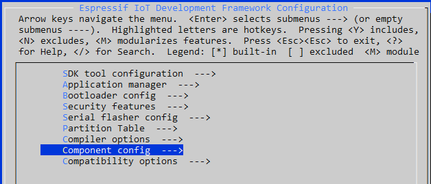
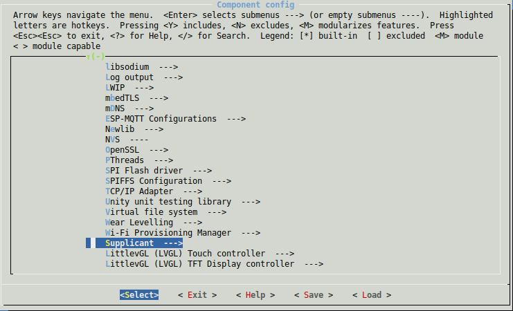

You can configure the TFT controller and the touch controller (if your display have one)

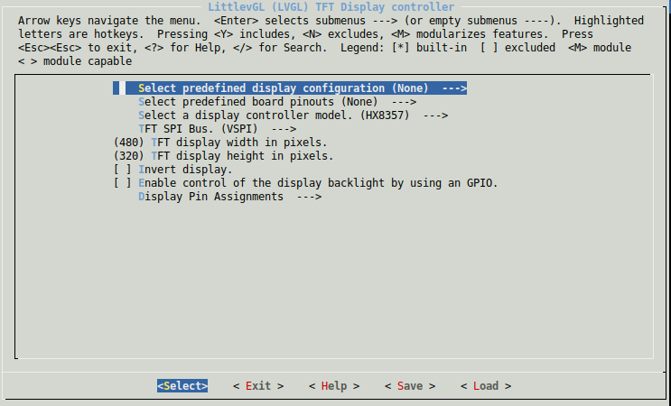
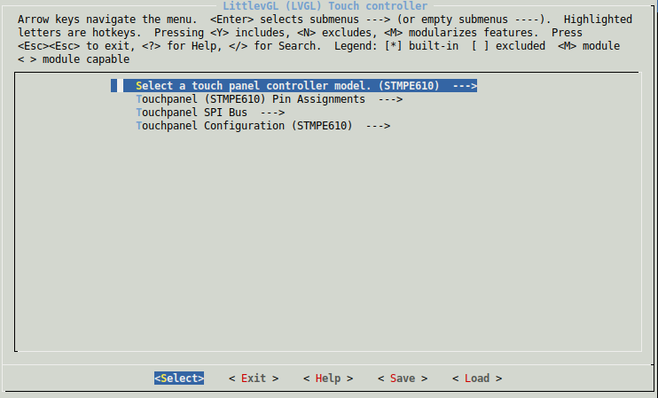

## Touch Controller options

Options include:
 * Touch controller options

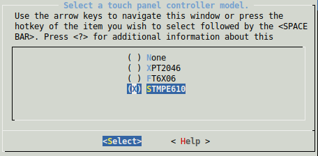

 * Pinout

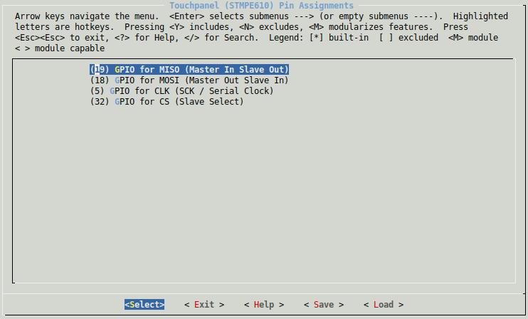

 * SPI Bus: Choose what SPI bus is used to communicate with the touch controller.


 * Touchpanel configuration: Maximum and minimum coordinate values, inverting coordinate values, etc.

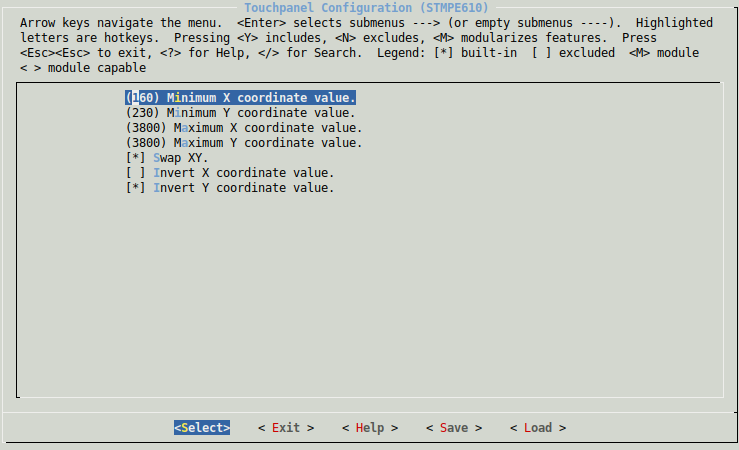

## TFT Controller options

Options include:

 * Display controller: Support for the most common TFT display controllers

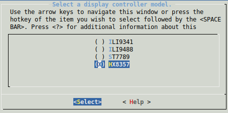

 * SPI Bus: Choose what SPI bus is used to communicate with the tft controller.


 * Display resolution - set the height and width of the display

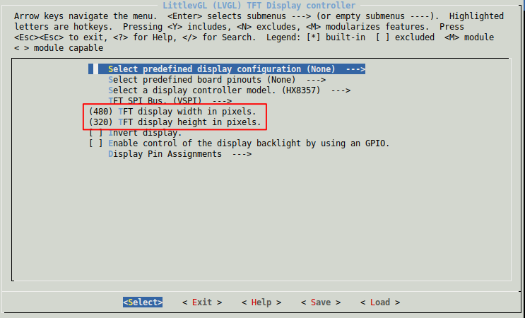

 * Invert display - if text and objects are backwards, you can enable this
 * Enable backlight control via GPIO (vs hardwiring on)
 * Backlight active high or low - some displays expect a high (1) signal to enable backlight, others expect (low) (default) - if your backlight doesn't come on try switching this

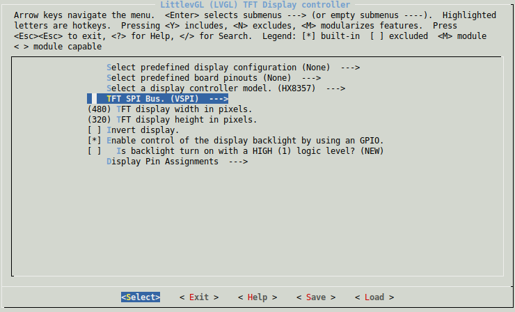

### Assign the correct pinout depending on your ESP32 dev board
There are several development boards based on the ESP32 chip, make sure you assign the correct pin numbers to the signals that interface with the TFT display board. Its recommended to use a predefined configuration below, but you can also set individual pins for both display controller and touch controller.

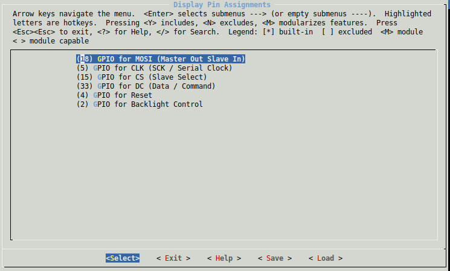

### Predefined Display Configurations

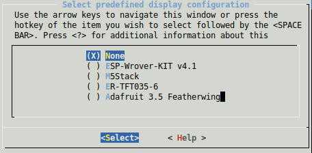

For development kits that come with a display already attached, all the correct settings are already known and can be selected in `menuconfig` from the first option "Select predefined display configuration." Once selected all the other options will be defaulted and won't appear in the menu.

Boards we currently have defined this way are:

### ESP-Wrover-Kit v4.1


This board comes with an embedded TFT screen with the **ILI9341** display driver and it doesn't have touch screen. The screen size is 320 x 240 px.

### M5Stack


This board comes with an embedded TFT screen with the **ILI9341** display driver and it doesn't have touch screen. The screen size is 240 x 320px.

### M5Stick


This board comes with an embedded OLED screen with the SH1107 monochrome display driver and it doesn't have touch screen. The screen size is 128 x 64px.


### WEMOS LOLIN ESP32 OLED


This board comes with an embedded OLED screen with the SSD1306 monochrome display driver and it doesn't have touch screen. The screen size is 128 x 64px.

## Predefined Board Pinouts


When wiring the display and touchpad (if applicable) it is best to use the board's designated HSPI and VSPI pins to take advantage of the hardware SPI support. Several board configurations are available; select the appropriate board in the "Select predefined board pinouts" menu in `menuconfig` and then wire the display and touchpad accordingly.

## ESP32 Dev Board with 38 GPIOs


### ILI9341 - HSPI
<table>
  <tr>
    <th>MOSI</th>
    <th>CLK</th>
    <th>CS</th>
    <th>DC</th>
    <th>RST</th>
    <th>BCKL</th>
  </tr>
  <tr>
    <td>13</td>
    <td>14</td>
    <td>5</td>
    <td>19</td>
    <td>18</td>
    <td>23</td>
  </tr>
</table>

### XPT2046 - VSPI

<table>
  <tr>
    <th>MOSI</th>
    <th>MISO</th>
    <th>CLK</th>
    <th>CS</th>
    <th>IRQ</th>
  </tr>
  <tr>
    <td>32</td>
    <td>35</td>
    <td>26</td>
    <td>33</td>
    <td>25</td>
  </tr>
</table>

## ESP32 DevKit v1 with 30 GPIOS

There is another development kit with only 30 GPIOs available:


### ILI9341

For ILI9341 HSPI is used, modify the pin configuration in `components/drv/disp_spi.h` to:

### ILI9341 - HSPI
<table>
  <tr>
    <th>MOSI</th>
    <th>CLK</th>
    <th>CS</th>
    <th>DC</th>
    <th>RST</th>
    <th>BCKL</th>
  </tr>
  <tr>
    <td>13</td>
    <td>14</td>
    <td>15</td>
    <td>2</td>
    <td>4</td>
    <td>21</td>
  </tr>
</table>

### XPT2046 - VSPI

<table>
  <tr>
    <th>MOSI</th>
    <th>MISO</th>
    <th>CLK</th>
    <th>CS</th>
    <th>IRQ</th>
  </tr>
  <tr>
    <td>23</td>
    <td>19</td>
    <td>18</td>
    <td>5</td>
    <td>25</td>
  </tr>
</table>

## ESP32 DevKit v4 with 38 GPIOS

See this pdf for further information: https://www.espressif.com/sites/default/files/documentation/esp32-wroom-32d_esp32-wroom-32u_datasheet_en.pdf

### ILI9341 - HSPI
<table>
<tr>
<th>MOSI</th>
<th>CLK</th>
<th>CS</th>
<th>DC</th>
<th>RST</th>
<th>BCKL</th>
</tr>
<tr>
<td>13</td>
<td>14</td>
<td>15</td>
<td>17</td>
<td>25</td>
<td>26</td>
</tr>
</table>

### XPT2046 - VSPI

<table>
<tr>
<th>MOSI</th>
<th>MISO</th>
<th>CLK</th>
<th>CS</th>
<th>IRQ</th>
</tr>
<tr>
<td>23</td>
<td>19</td>
<td>18</td>
<td>5</td>
<td>27</td>
</tr>
</table>

## Sparkfun ESP32 Thing Plus with Adafruit 3.5" 480x320 TFT Featherwing

[Sparkfun ESP32 Thing Plus](https://www.sparkfun.com/products/15663)

[Adafruit 3.5" 480x320 TFT Featherwing](https://www.adafruit.com/product/3651)


The Adafruit Featherwing board uses a HX8357D TFT display controller and a STMPE610 resistive touch controller.  Both are hardwired to the same SPI bus (VSPI).  The STMPE610 is a strange little beast that configures its SPI mode based on the logic levels on MISO and CS during its power-on reset.  The CS signal has a pull-up but the MISO is floating.  It appears that it is usually sampled low (setting SPI Mode 1) but you may find you need a pull-down resistor from MISO to ground.  A 47-kohm resistor will work fine.  The TFT reset and backlight pins are not connected (hardwired on the Featherwing).  There is no touchpad IRQ.  These signals are connected to unused signals in the following configuration.  Note that although I used a Sparkfun ESP32 board, the Adafruit ESP32 featherwing should work identically.

### HX8357D - VSPI
<table>
<tr>
<th>MOSI</th>
<th>CLK</th>
<th>CS</th>
<th>DC</th>
<th>RST</th>
<th>BCKL</th>
</tr>
<tr>
<td>18</td>
<td>5</td>
<td>15</td>
<td>33</td>
<td>4</td>
<td>2</td>
</tr>
</table>

### STMPE610 - VSPI

<table>
<tr>
<th>MOSI</th>
<th>MISO</th>
<th>CLK</th>
<th>CS</th>
<th>IRQ</th>
</tr>
<tr>
<td>18</td>
<td>19</td>
<td>5</td>
<td>32</td>
<td>25</td>
</tr>
</table>


## Other Boards

Of course, all the individual pins can be configured in `menuconfig` if the available predefined options don't match your board or project requirements. By default the predefined options are disabled and pin settings for the 30 pin dev board are defaulted.

### Reference Pinout for the Predefined Boards

As a reference the assigned pins for the predefined boards is given below.

### M5Stack

You can choose between the predefined board for M5Stick, or use the predefined board pinouts, choose SH1107 display controller and configure other options.

<table>
<tr>
<th>MOSI</th>
<th>CLK</th>
<th>CS</th>
<th>DC</th>
<th>RST</th>
<th>BCKL</th>
</tr>
<tr>
<td>23</td>
<td>18</td>
<td>14</td>
<td>27</td>
<td>33</td>
<td>32</td>
</tr>
</table>


### M5Stick 

You can choose between the predefined board for M5Stick, or use the predefined board pinouts, choose SH1107 display controller and configure other options.

<table>
<tr>
<th>MOSI</th>
<th>CLK</th>
<th>CS</th>
<th>DC</th>
<th>RST</th>
</tr>
<tr>
<td>23</td>
<td>18</td>
<td>14</td>
<td>27</td>
<td>33</td>
</tr>
</table>

### WEMOS LOLIN 

You can choose between the predefined board for WEMOS LOLIN, or use the predefined board pinouts, choose SSD1306  display controller and configure other options.

<table>
<tr>
<th>SDA</th>
<th>SCL</th>
</tr>
<tr>
<td>5</td>
<td>4</td>
</tr>
</table>


## Kconfig and Project Configuration

The ESP32 SDK (ESP-IDF) uses [kconfiglib](https://github.com/ulfalizer/Kconfiglib) which is a Python-based extension to the [Kconfig](https://www.kernel.org/doc/Documentation/kbuild/kconfig-language.txt) system which provides a compile-time project configuration mechanism. Using `idf.py menuconfig` will update the file sdkconfig and, during build, provide the file sdkconfig.h.

The following options will be defined and can be used in implementations:

- Predefined display configurations section in file `sdkconfig`

  ```
  CONFIG_LVGL_PREDEFINED_DISPLAY_NONE=y
  CONFIG_LVGL_PREDEFINED_DISPLAY_WROVER4=
  CONFIG_LVGL_PREDEFINED_DISPLAY_M5STACK=
  CONFIG_LVGL_PREDEFINED_DISPLAY_M5STICK=
  CONFIG_LVGL_PREDEFINED_DISPLAY_ERTFT0356=
  CONFIG_LVGL_PREDEFINED_DISPLAY_ADA_FEATHERWING=
  CONFIG_LVGL_PREDEFINED_DISPLAY_RPI_MPI3501=
  CONFIG_LVGL_PREDEFINED_DISPLAY_WEMOS_LOLIN=
  ```

In general, only lines with an assigned value will appear in `sdkconfig.h`. For example, the previous block will result in the following single line in `sdkconfig.h`

```
#define CONFIG_LVGL_PREDEFINED_DISPLAY_NONE 1
```

* Display controller, one entry out of the following list

  ```
  CONFIG_LVGL_TFT_DISPLAY_CONTROLLER_ILI9341
  CONFIG_LVGL_TFT_DISPLAY_CONTROLLER_ILI9488
  CONFIG_LVGL_TFT_DISPLAY_CONTROLLER_ST7789
  CONFIG_LVGL_TFT_DISPLAY_CONTROLLER_HX8357
  CONFIG_LVGL_TFT_DISPLAY_CONTROLLER_SH1107
  CONFIG_LVGL_TFT_DISPLAY_CONTROLLER_SSD1306
  ```

* Display controller protocol, either SPI or I2C

  ```
  CONFIG_LVGL_TFT_DISPLAY_PROTOCOL_SPI=
  CONFIG_LVGL_TFT_DISPLAY_PROTOCOL_I2C=y
  ```

* Display orientation

  ```
  CONFIG_LVGL_DISPLAY_ORIENTATION_PORTRAIT=
  CONFIG_LVGL_DISPLAY_ORIENTATION_LANDSCAPE=y
  ```

* Display width and heigth in px

  ```
  CONFIG_LVGL_DISPLAY_ORIENTATION_PORTRAIT=
  CONFIG_LVGL_DISPLAY_ORIENTATION_LANDSCAPE=y
  CONFIG_LVGL_DISPLAY_WIDTH=128
  CONFIG_LVGL_DISPLAY_HEIGHT=64
  ```

* Pins

  ```
  CONFIG_LVGL_DISP_SPI_MOSI=13
  CONFIG_LVGL_DISP_SPI_CLK=14
  CONFIG_LVGL_DISP_SPI_CS=15
  CONFIG_LVGL_DISP_PIN_DC=2
  CONFIG_LVGL_DISP_PIN_RST=4
  CONFIG_LVGL_DISP_PIN_BCKL=27
  CONFIG_LVGL_DISP_PIN_SDA=5
  CONFIG_LVGL_DISP_PIN_SCL=4
  ```

* HSPI and VSPI SPI Bus

  ```
  CONFIG_LVGL_TFT_DISPLAY_SPI_HSPI=
  CONFIG_LVGL_TFT_DISPLAY_SPI_VSPI=
  ```
  
* Other options like

  ```
  CONFIG_LVGL_INVERT_DISPLAY=y
  CONFIG_LVGL_ENABLE_BACKLIGHT_CONTROL=y
  CONFIG_LVGL_BACKLIGHT_ACTIVE_LVL=y
  ```


* The following defines **should not be used** directly because they are only "helper" defines and will probably removed in future versions. Use the defines starting with `CONFIG_LVGL_TFT_DISPLAY_CONTROLLER_` instead.

  ```
  CONFIG_LVGL_TFT_DISPLAY_USER_CONTROLLER_ILI9341
  CONFIG_LVGL_TFT_DISPLAY_USER_CONTROLLER_ILI9488
  CONFIG_LVGL_TFT_DISPLAY_USER_CONTROLLER_ST7789
  CONFIG_LVGL_TFT_DISPLAY_USER_CONTROLLER_HX8357
  CONFIG_LVGL_TFT_DISPLAY_USER_CONTROLLER_SH1107
  CONFIG_LVGL_TFT_DISPLAY_USER_CONTROLLER_SSD1306=y
  ```

